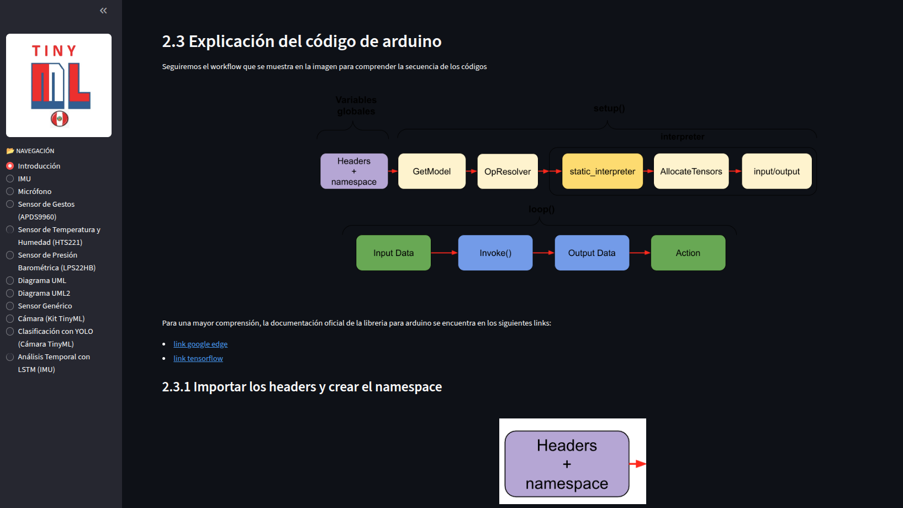

# TinyML + Streamlit: Documentación y Demo Interactiva para Arduino

Este repositorio presenta un **proyecto demostrativo de TinyML** que integra el **entrenamiento de un modelo de aprendizaje automático en Python**, su **conversión a TensorFlow Lite para microcontroladores**, y una **aplicación web interactiva desarrollada con Streamlit** para visualizar y probar el comportamiento del modelo.

El objetivo principal es **mostrar el flujo completo de desarrollo TinyML**, desde la generación de datos y entrenamiento del modelo, hasta su despliegue en un entorno embebido (Arduino) y su validación mediante una interfaz web.


---

## 🎯 Objetivos del proyecto

- Demostrar un **pipeline completo de TinyML**:
  1. Generación de datos
  2. Entrenamiento de un modelo ligero
  3. Conversión a TensorFlow Lite
  4. Exportación a formato compatible con microcontroladores
  5. Visualización y prueba mediante Streamlit

- Facilitar la **comprensión del comportamiento del modelo** antes de su despliegue en hardware real.

- Servir como **material educativo y de documentación** para cursos o talleres de TinyML, Machine Learning embebido o Edge AI.

---

## 🧠 Tecnologías utilizadas

- **Python 3**
- **TensorFlow / Keras**
- **TensorFlow Lite**
- **Streamlit**
- **Arduino (TinyML)**
- **NumPy, Pandas, Matplotlib**

---

## 📁 Estructura del repositorio

```text
tinymldoc/
│
├── data.csv
│   Conjunto de datos utilizado para el entrenamiento y pruebas del modelo.
│
├── crea_modelo.ipynb
│   Notebook para el entrenamiento del modelo de Machine Learning usando Keras.
│
├── gen_data_toy1.ipynb
│   Notebook para la generación de datos sintéticos de ejemplo.
│
├── model.h5
│   Modelo entrenado en formato Keras (entrenamiento en Python).
│
├── model.tflite
│   Modelo convertido a TensorFlow Lite para inferencia ligera.
│
├── model.h
│   Modelo exportado como arreglo de bytes en C para uso en microcontroladores (Arduino).
│
├── tinyml_arduino_streamlit_FINAL_OK_v10.py
│   Aplicación principal en Streamlit para interactuar con el modelo y visualizar inferencias.
│
├── requirements.txt
│   Lista de dependencias necesarias para ejecutar la aplicación en Python.
│
└── README.md
│   Documentación general del proyecto.
